<table>
<tr>
<td width="180">

</td>

<td valign="middle">

# Smart Logistics Intelligence System for Delivery Optimization & Risk Prediction

</td>
</tr>
</table>

## Project Overview

Fast Man Company handles thousands of deliveries daily, making it difficult to monitor delays, returns, and operational risks efficiently.

This project combines Business Intelligence, Data Analytics, and Machine Learning to improve delivery performance and support data-driven decision-making.

---

## Business Challenge

The company experienced:

- Delivery delays
- Returned orders
- Revenue loss
- Inefficient route planning
- Difficulty identifying high-risk deliveries

The goal was to develop an intelligent system capable of monitoring, predicting, and optimizing logistics operations.

---

## Data & Preparation

The project used real operational data provided by Fast Man Company.

### Dataset Includes

- Shipment records
- Customer information
- Driver performance
- Payment methods
- Delivery timelines
- Return information

### Data Cleaning & Transformation

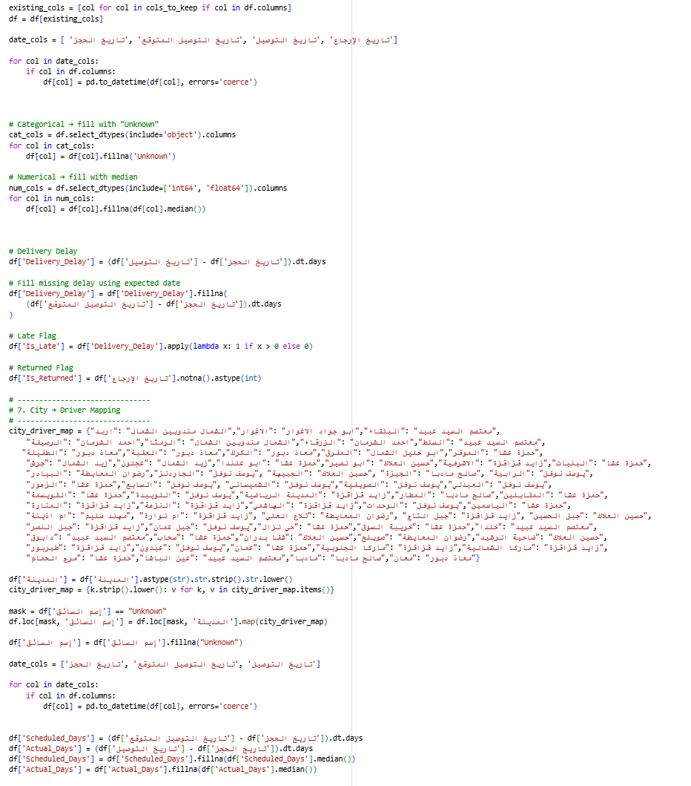

Main preprocessing tasks:

- Handling missing values
- Standardizing text fields
- Converting date columns
- Creating delivery delay indicators
- Building new analytical features

---

## Operations Performance Dashboard

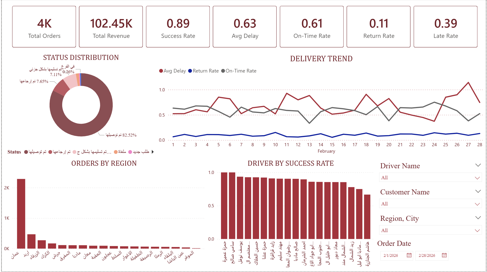

### Key Insights

- Total Orders
- Total Revenue
- Success Rate
- Return Rate
- On-Time Delivery Rate

### Business Impact

Provides management with a complete operational overview and supports performance monitoring.

---

## Delay Analysis Dashboard

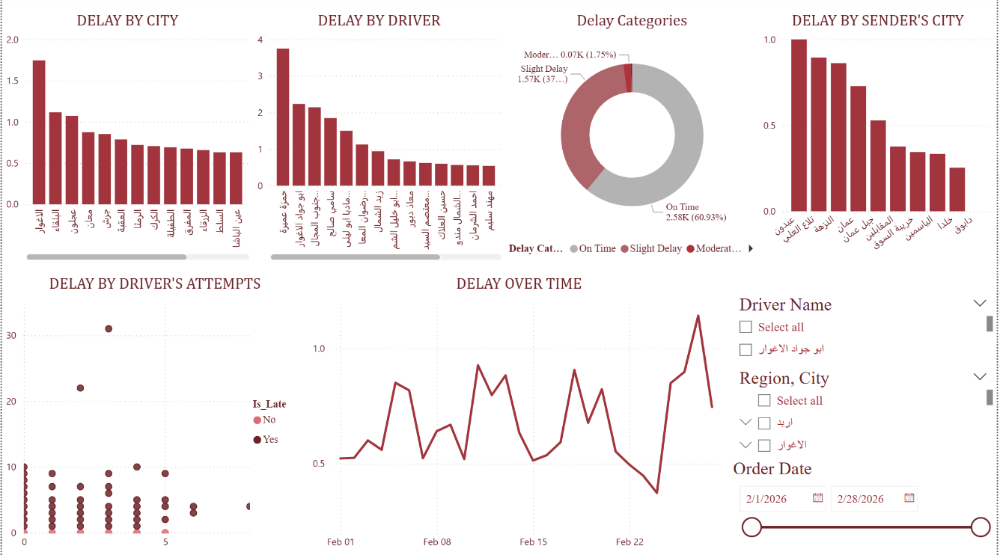

### Key Insights

- Delay by city
- Delay by driver
- Delay trends
- Delivery attempts impact

### Business Impact

Helps identify bottlenecks and reduce delayed deliveries.

---

## Route Optimization Dashboard

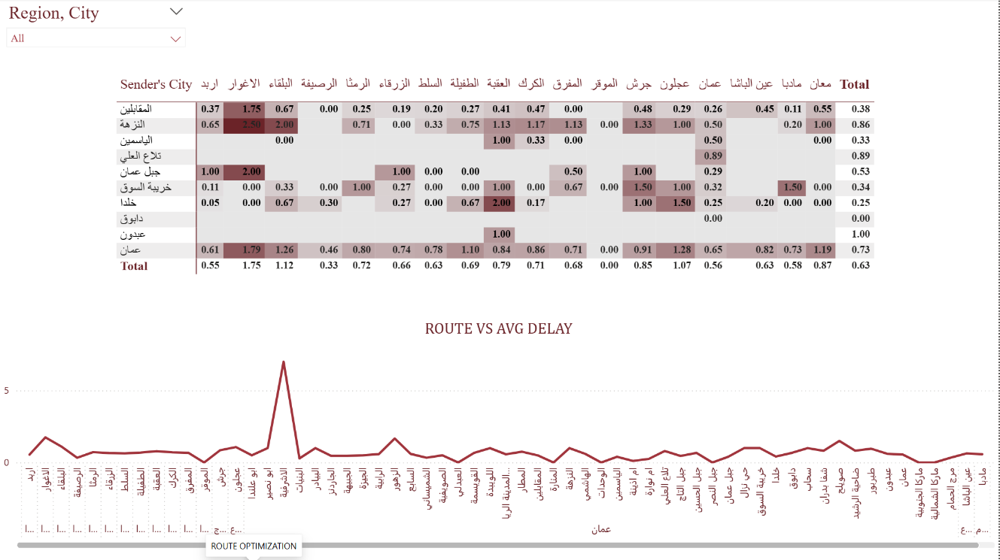

### Key Insights

- Route performance
- Average delay by route
- High-risk delivery paths

### Business Impact

Supports route optimization and faster deliveries.

---

## Return Analysis Dashboard

### Key Insights

- Failure reasons
- Return trends
- Regional return rates
- Driver return performance

### Business Impact

Reduces failed deliveries and improves customer satisfaction.

---

## Risk Analysis Dashboard

### Key Insights

- Driver risk analysis
- Customer risk analysis
- Lost revenue
- Regional risk scores

### Business Impact

Supports proactive operational risk management.

---

## Financial & Customer Insights

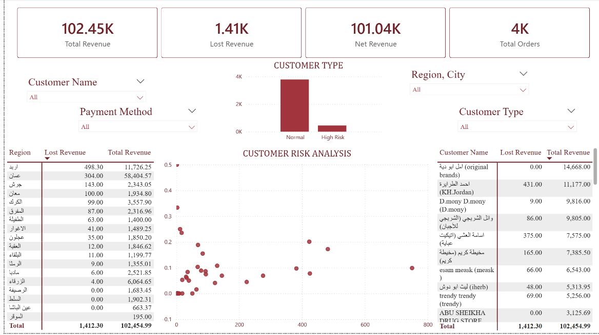

### Key Insights

- Revenue performance
- Lost revenue analysis
- Customer segmentation
- Customer risk evaluation

### Business Impact

Improves profitability and customer relationship management.

---

## Predictive Analytics

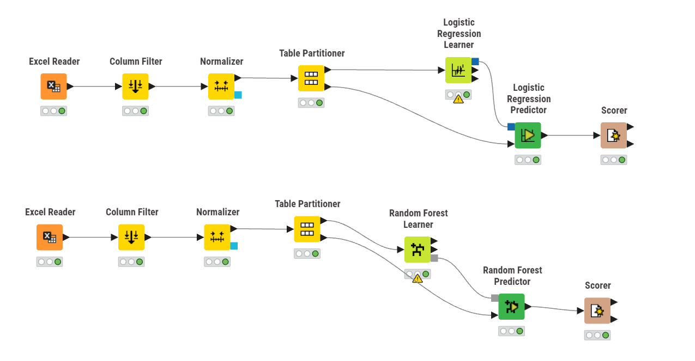

Machine Learning models were developed to predict delivery outcomes and operational risks.

### Models

- Logistic Regression
- Random Forest

---

## Logistic Regression Results

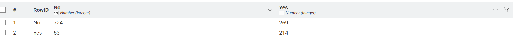

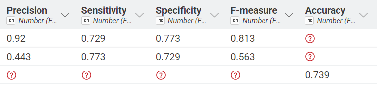

### Performance

- Accuracy: 73.9%
- Precision: 92%
- Recall: 72.9%

---

## Random Forest Results

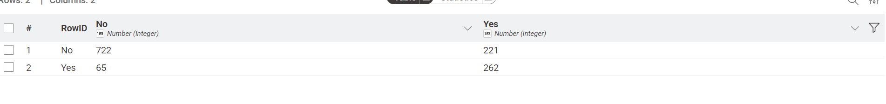

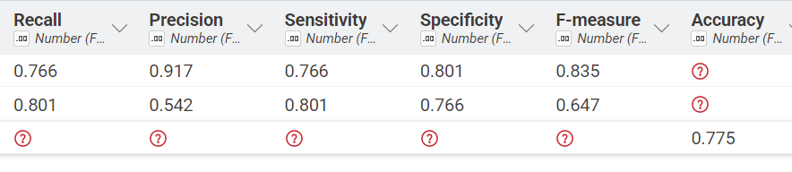

### Performance

- Accuracy: 77.5%
- Precision: 91.7%
- Recall: 76.6%

### Best Model

**Random Forest** achieved the highest predictive performance.

---

## Clustering Analysis

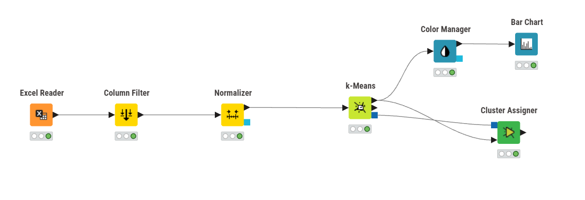

K-Means clustering segmented deliveries into three operational groups.

### Cluster 2 – Stable Deliveries

- Low delays
- Low return rates
- Efficient operations

### Cluster 1 – Moderate Risk Deliveries

- Moderate delays
- Requires closer monitoring

### Cluster 0 – High Risk Deliveries

- High delays
- High return probability
- Multiple delivery attempts

---

## Cluster Visualization

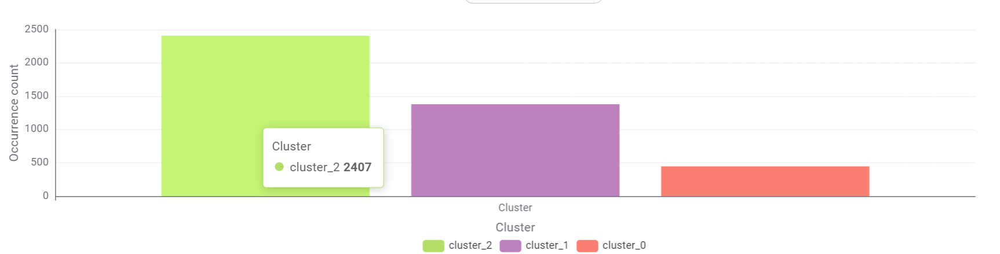

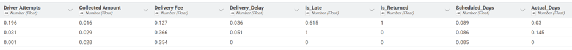

The clustering model successfully identified different delivery behaviors and risk levels.

---

## Business Value

This solution enables Fast Man Company to:

- Reduce delays
- Reduce returns
- Improve driver performance
- Optimize routes
- Increase customer satisfaction
- Minimize revenue loss

---

# Conclusion

The Smart Logistics Intelligence System demonstrates how Business Intelligence and Artificial Intelligence can transform logistics data into actionable insights.

Through dashboards, predictive analytics, and clustering techniques, Fast Man Company can improve operational efficiency, reduce risks, and support smarter business decisions.****
