# Smart Logistics Intelligence System for Delivery Optimization & Risk Prediction

## Authors

Halla Alaa Eddin Awad, Dania Ibrahim Alqaisi & Rakan Al Saied Obaid

202320408, 202210477, 202111418

## Supervised by

Dr Husam Barham

Course: 307498 – Graduation Project

Second Semester, 2026/2027

---

Contents

[**Abstract** 3](#_Toc230131607)

[**Acknowledgment** 4](#_Toc230131608)

[**Business Intelligence Project Description and Objectives** 5](#_Toc230131609)

[**Project Description and Goal** 5](#_Toc230131610)

[**Project Objectives** 5](#_Toc230131611)

[**Data Research and Acquiring Effort** 6](#_Toc230131612)

[**Data Description and Understanding** 7](#_Toc230131613)

[**Data Dictionary** 7](#_Toc230131614)

[**Exploratory Data Analysis (EDA)** 9](#_Toc230131615)

[**Data Primary Cleaning and Transformation** 10](#_Toc230131616)

[**Data Visualization and Insights** 12](#_Toc230131617)

[**Advanced Analytics and AI Modeling** 24](#_Toc230131618)

[Supervised Models 24](#_Toc230131619)

[Clustering Analysis 24](#_Toc230131620)

[Prediction Model 25](#_Toc230131621)

[Logistic Regression 26](#_Toc230131622)

[Random Forest 27](#_Toc230131623)

[Model Comparison 28](#_Toc230131624)

[Clustering 29](#_Toc230131625)

[**Tools Research and Selection Effort** 32](#_Toc230131626)

[**Project Deployment Effort - Use Case** 33](#_Toc230131627)

[**Results** 35](#_Toc230131628)

[**References** 35](#_Toc230131629)

---

## Abstract

This project investigates the application of business intelligence, data analytics, and machine learning techniques to analyze logistics and delivery operations within Fast Man in Jordan. The study aims to support data-driven decision-making by identifying the factors affecting delivery delays, return rates, driver performance, and overall operational efficiency. The project focuses on analyzing shipment information, customer data, delivery timelines, payment methods, driver activities, and geographic locations to uncover operational patterns and improve delivery performance.

The implementation phase involved data cleaning, preprocessing, transformation, and exploration data analysis using Python and Google Colab. Interactive dashboards were developed in Microsoft Power BI to visualize delivery performance, delay trends, driver efficiency, return behavior, customer activity, and operational KPIs. Predictive analytics was conducted using Logistic Regression, Random Forest, and Decision Tree classification models in KNIME Analytics Platform to predict whether a shipment would be delivered late. Model performance was evaluated using classification metrics including accuracy, precision, recall, F1-score, ROC Curve, and AUC Score. In addition, K-Means clustering was applied to segment deliveries into distinct operational groups based on delay behavior, delivery attempts, returns, and delivery duration.

The results demonstrate that the predictive models achieved strong classification performance, with the Random Forest model outperforming other models by capturing complex relationships between operational variables. Analysis revealed that delivery attempts, scheduled delivery duration, actual delivery duration, geographic location, and driver activity were among the most influential factors affecting shipment delays and returns. Furthermore, clustering analysis identified meaningful operational segments such as efficient deliveries, delayed shipments, and high-risk returned deliveries, enabling more effective operational planning and resource allocation. Overall, the integration of descriptive analytics, predictive modeling, clustering, and business intelligence dashboards within a unified framework proved effective in delivering actionable insights, improving logistics performance, optimizing delivery operations, and supporting strategic decision-making for Fast Man Company.

---

## Acknowledgment

We would like to express our sincere gratitude to our professor and academic supervisor for their invaluable guidance, continuous support, and constructive feedback throughout the development of this project. Their expertise, encouragement, and dedication played a significant role in improving the quality of this work and enhancing our knowledge in the field of Business Intelligence and Data Analytics.

We would also like to extend our deepest appreciation to our families and friends for their constant encouragement, patience, and motivation during every stage of this journey. Their support gave us the strength and determination to overcome challenges and successfully complete this project.

Special thanks are extended to Fast Man for providing the dataset and supporting this study, which allowed us to apply analytical and machine learning techniques to real-world logistics and delivery operations.

We are also grateful to the faculty and staff members whose commitment to academic excellence created a supportive learning environment that encouraged innovation, critical thinking, and practical learning.

Finally, we would like to thank everyone who contributed directly or indirectly to the success of this group project. Your support and encouragement have had a meaningful impact on both our academic and personal development.

---

## Business Intelligence Project Description and Objectives

### Project Description and Goal

This project focuses on applying Business Intelligence, data analytics, and machine learning techniques within the logistics and delivery sector to analyze shipment operations and improve operational efficiency at Fast Man in Jordan. The project aims to transform raw shipment and operational data into meaningful insights through descriptive analytics, predictive modeling, and clustering techniques.

The project analyzes shipment details, customer information, delivery timelines, driver performance, payment methods, return operations, and geographic delivery locations to better understand the factors affecting delivery delays, failed deliveries, and return rates. By integrating tools such as Python, Google Colab, Microsoft Power BI, and KNIME Analytics Platform, the project demonstrates how data-driven approaches can support logistics companies in improving delivery performance, optimizing operational efficiency, reducing delays and returns, and supporting strategic decision-making.

Interactive dashboards, predictive machine learning models, and clustering techniques were implemented to provide both analytical insights and intelligent decision-support solutions for logistics and delivery optimization.

### Project Objectives

- Analyze shipment and delivery operations to identify patterns affecting delays, returns, and overall logistics performance.

- Develop machine learning models, including Logistic Regression, Random Forest, and Decision Tree, to predict late deliveries.

- Identify the key factors influencing delivery efficiency, such as driver attempts, delivery duration, geographic location, and return status.

- Apply K-Means clustering to segment deliveries into operational groups based on delay behavior and delivery performance.

- Design interactive Microsoft Power BI dashboards to support data-driven decision-making and improve logistics operations at Fast Man.

---

## Data Research and Acquiring Effort

The data used in this project was obtained from Fast Man in Jordan and consists of real-world logistics and shipment delivery records. The primary objective during the data acquisition phase was to obtain operational data that accurately represents shipment activities, delivery performance, customer interactions, driver operations, payment methods, and return processes. These factors are essential for analyzing logistics performance, predicting delivery delays, reducing returns, and improving operational efficiency.

The selected dataset contains detailed information about shipments, including shipment status, driver information, sender and delivery locations, delivery attempts, payment and collection methods, delivery fees, booking dates, expected and actual delivery dates, return operations, and delivery failure reasons. The dataset also includes operational indicators such as delivery delay, late delivery status, scheduled delivery duration, actual delivery duration, and return status. This dataset was selected because it provides comprehensive information required for descriptive analytics, predictive modeling, clustering analysis, and business intelligence dashboard development.

The dataset was imported into Python, Google Colab, Microsoft Excel, Microsoft Power BI, and KNIME Analytics Platform for data cleaning, preprocessing, transformation, visualization, and machine learning implementation. Significant preprocessing efforts were performed to handle missing values, standardize operational data, generate calculated features, and improve data quality for analysis and predictive modeling.

The use of real operational logistics data enabled a comprehensive analysis of delivery performance and operational behavior through descriptive analytics, predictive modeling, and clustering techniques. This supports the development of data-driven logistics strategies that can help improve delivery efficiency, optimize operational planning, reduce delays and returns, and support strategic decision-making within the logistics sector.

---

## Data Description and Understanding

### Data Dictionary

The dataset used in this project contains logistics, shipment, delivery, and operational information collected from Fast Man in Jordan. The dataset consists of shipment records used to analyze delivery performance, operational efficiency, return behavior, and delayed deliveries.

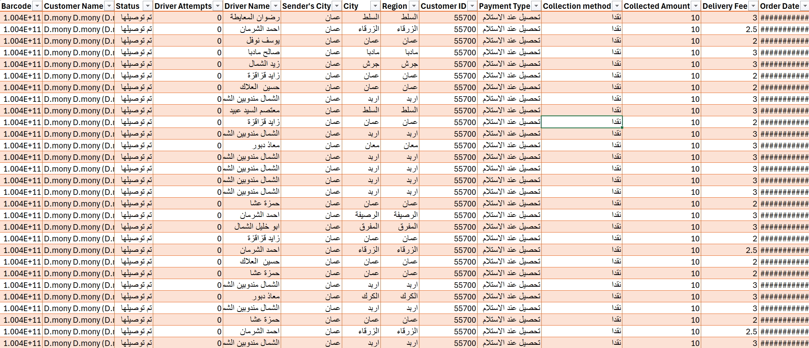

| Column Name | Description | Use |
| --- | --- | --- |
| Barcode | Unique shipment identifier | Used to uniquely identify each shipment record |
| Customer_Name | Name of the customer | Used for shipment tracking and customer reference |
| Order_Status | Current shipment status | Helps analyze delivery success, delays, and operational outcomes |
| Driver_Attempts | Number of delivery attempts made by the driver | Used to analyze failed deliveries and operational efficiency |
| Driver_Name | Name of the assigned driver | Used to evaluate driver performance and delivery efficiency |
| Sender_City | City of the sender | Helps analyze shipment origins and regional shipment activity |
| Delivery_City | Destination city of the shipment | Used for geographic delivery analysis and delay evaluation |
| Region | Delivery region or area | Supports geographic segmentation and route analysis |
| Customer_ID | Unique customer identifier | Used for customer behavior analysis and clustering |
| Payment_Method | Method of payment used | Helps analyze payment behavior and operational patterns |
| Collection_Method | Shipment collection method | Used to evaluate collection and payment processes |
| Collection_Amount | Amount collected from shipment | Used for financial and revenue analysis |
| Delivery_Price | Shipment delivery fee | Used to evaluate operational cost and revenue performance |
| Booking_Date | Date when the shipment was booked | Used for shipment timeline analysis |
| Expected_Delivery_Date | Scheduled delivery date | Used to calculate planned delivery duration |
| Delivery_Date | Actual shipment delivery date | Used to analyze delivery performance and delays |
| Return_Date | Date of shipment return | Used to analyze returned shipments and failed deliveries |
| Delivery_Duration | Time required to complete delivery | Used to evaluate operational efficiency |
| Failure_Reason_ | Primary reason for delivery failure | Helps identify major causes of failed deliveries |
| Scheduled_Days | Planned number of delivery days | Used to compare planned vs actual delivery performance |
| Actual_Days | Actual number of delivery days | Used to measure operational delivery efficiency |
| Delivery_Delay | Difference between planned and actual delivery time | Main indicator used to analyze delayed deliveries |
| Is_Late | Indicates whether shipment was delivered late | Target variable used for predictive modeling |
| Is_Returned | Indicates whether shipment was returned | Used to analyze return behavior and failed deliveries |

---

### Exploratory Data Analysis (EDA)

Initial Exploratory Data Analysis (EDA) was performed to understand the structure, distribution, and operational behavior of the logistics and shipment data before applying predictive and clustering models. Various charts, visualizations, and statistical summaries were used to uncover patterns, trends, and anomalies related to delivery performance, shipment delays, driver efficiency, and return operations.

Histograms and descriptive statistics were applied to numerical variables such as Delivery Price, Driver Attempts, Scheduled Days, Actual Days, and Delivery Delay. The analysis showed that delivery delays follow a right-skewed distribution, indicating that most shipments are delivered within normal delivery periods, while a smaller number of shipments experience significant delays. Box plots for delivery attempts and delivery duration revealed the presence of operational outliers, suggesting problematic shipments that required multiple delivery attempts or experienced unusually long delivery times.

Bar charts and pivot tables were used to analyze categorical variables such as Delivery City, Driver Name, Payment Method, Shipment Status, and Failure Reasons. The results showed that certain cities and regions experience higher delay and return rates compared to others. Driver performance analysis also highlighted variations in delivery efficiency between drivers, while failure reason analysis identified the most common operational issues causing unsuccessful deliveries.

Scatter plots between Scheduled Days and Delivery Delay demonstrated a positive relationship, indicating that shipments with longer planned delivery durations tend to experience higher delays. Additional analysis between Driver Attempts and Delivery Delay showed that repeated delivery attempts are strongly associated with delayed and returned shipments.

Overall, the EDA phase provided valuable operational insights, identified delivery inefficiencies and high-risk shipment patterns, and guided feature selection for predictive modeling and clustering analysis. These findings directly support the project's objective of improving logistics performance, reducing delivery delays and returns, optimizing operational efficiency, and enabling data-driven decision-making through business intelligence.

---

### Data Primary Cleaning and Transformation

Data cleaning and transformation were performed to prepare the logistics dataset for analysis, visualization, clustering, and predictive modeling. The main objective was to improve data quality by handling missing values, correcting formatting issues, and creating new operational variables related to delivery performance.

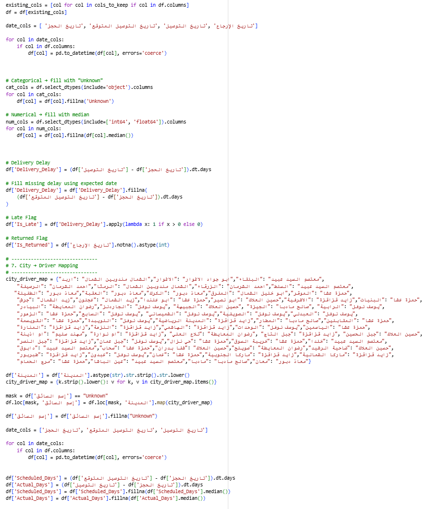

The preprocessing process was carried out using Python in Google Colab and additional transformations in Power Query within Power BI.

#### Main Cleaning and Transformation Steps

- **Changed Data Types:** Date columns such as Booking Date, Expected Delivery Date, Delivery Date, and Return Date were converted into datetime format, while numerical and categorical columns were assigned appropriate data types.

- **Handled Missing Values:** Missing categorical values were replaced with "Unknown", while missing numerical values were filled using median values to maintain data consistency.

- **Standardized Text Fields:** Columns such as City and Driver Name were cleaned using text trimming and formatting standardization to remove inconsistencies.

- **Driver Mapping:** Missing driver names were assigned automatically using a city-to-driver mapping approach based on Fast Man operational routing.

- **Created New Features:** Additional analytical variables were generated including:
  - Delivery_Delay
  - Scheduled_Days
  - Actual_Days
  - Is_Late
  - Is_Returned

- **Filtered Relevant Data:** Only important shipment, delivery, customer, and operational columns were retained for analysis and modeling.

#### Purpose

These preprocessing steps ensured that the dataset became accurate, consistent, and analysis-ready for exploratory analysis, machine learning models, clustering, and interactive Power BI dashboards to support data-driven logistics decision-making.

---

## Data Visualization and Insights

### Dashboard Design & Business Insights

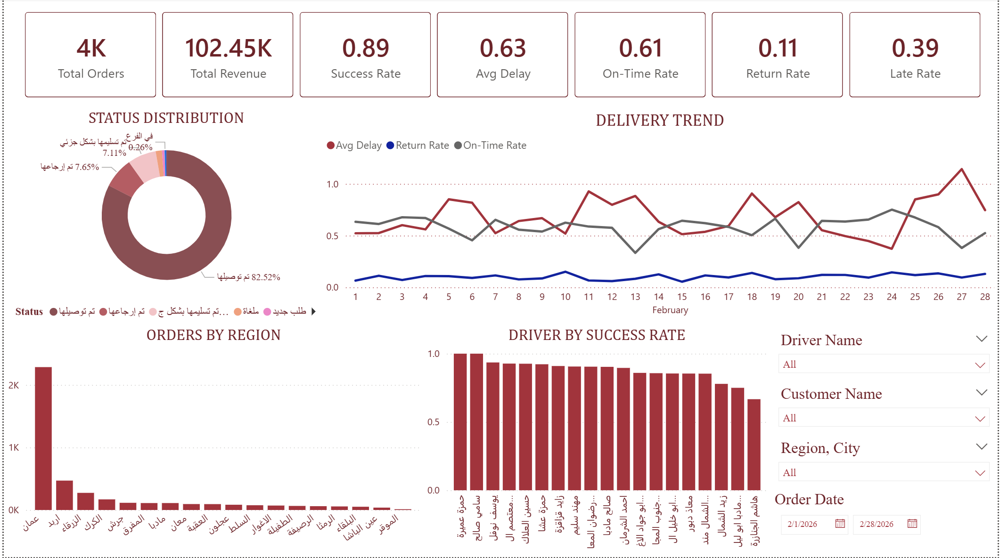

#### Overview Dashboard

**Dashboard Purpose**

This dashboard provides an overall view of Fast Man company's delivery operations and logistics performance. It helps monitor delivery efficiency, delays, return rates, driver performance, and regional order distribution to support operational decision-making and service improvement.

**KPI Cards**

- Total Orders: Shows total number of orders handled.
- Total Revenue: Displays total revenue generated from deliveries.
- Success Rate: Measures percentage of successfully delivered orders.
- Average Delay: Shows average delivery delay duration.
- On-Time Rate: Measures percentage of orders delivered on schedule.
- Return Rate: Shows percentage of returned orders.
- Late Rate: Indicates percentage of delayed deliveries.

**Business Use:**
These KPIs provide management with a quick overview of operational performance, service quality, and delivery efficiency.

**Status Distribution (Donut Chart)**

Displays the distribution of order statuses such as delivered, returned, partially delivered, canceled, and new orders.

**Business Use:** Helps identify the most common delivery outcomes and evaluate operational success and customer satisfaction levels.

**Delivery Trend (Line Chart)**

Shows trends of average delay, return rate, and on-time rate across different days in February.

**Business Use:** Allows management to monitor daily operational performance, detect delivery problems, and identify periods with high delays or returns.

**Orders by Region (Bar Chart)**

Displays the number of orders across different cities and regions.

**Business Use:** Helps identify high-demand areas, optimize resource allocation, and support delivery planning decisions.

**Driver by Success Rate (Bar Chart)**

Compares drivers based on their delivery success rates.

**Business Use:** Supports driver performance evaluation, identifies top-performing drivers, and helps improve operational efficiency through performance monitoring.

**Filters / Slicers**

Includes filters for driver name, customer name, region/city, and order date.

**Business Use:** Allows users to perform detailed analysis, compare performance across locations or drivers, and generate customized operational insights.

**How This Dashboard Supports the Project**

This dashboard supports the project by transforming delivery and logistics data into actionable business insights. It enables the company to analyze operational performance, monitor delivery efficiency, identify delay patterns, evaluate driver performance, and improve decision-making using business intelligence and data analytics techniques.

---

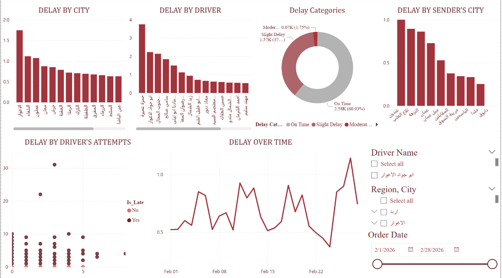

#### Delay Analysis Dashboard

**Dashboard Purpose**

This dashboard focuses on analyzing delivery delays across cities, drivers, sender locations, and time periods. It helps identify the main causes and patterns of delays to improve delivery efficiency and operational performance.

**Delay by City (Bar Chart)**

Shows average delivery delay across different cities.

**Business Use:** Helps identify cities with the highest delays so management can improve delivery planning, driver allocation, and logistics operations in those areas.

**Delay by Driver (Bar Chart)**

Compares drivers based on average delivery delay.

**Business Use:** Supports driver performance evaluation by identifying drivers with frequent delays and helping management improve accountability and training.

**Delay Categories (Donut Chart)**

Displays the percentage of on-time, slightly delayed, and moderately delayed deliveries.

**Business Use:** Provides a clear overview of delivery service quality and helps measure operational efficiency and customer satisfaction.

**Delay by Sender's City (Bar Chart)**

Shows delivery delays based on the sender's location.

**Business Use:** Helps identify sender regions that generate more delayed orders, support route optimization and operational improvements.

**Delay by Driver's Attempts (Scatter Plot)**

Analyzes the relationship between delivery attempts and delayed deliveries.

**Business Use:** Shows whether increasing delivery attempts contributes to delays, helping improve delivery scheduling and communication with customers.

**Delay Over Time (Line Chart)**

Displays delivery delay trends across different days in February.

**Business Use:** Helps monitor operational stability over time and detect days with unusually high delays for further investigation.

**Filters / Slicers**

Includes filters for driver name, region/city, and order date.

**Business Use:** Allows detailed analysis for specific drivers, regions, or time periods to support operational decision-making.

**How This Dashboard Supports the Project**

This dashboard supports the project by identifying operational inefficiencies and delivery delay patterns using business intelligence and analytics techniques. It helps Fast Man company improve delivery performance, reduce delays, optimize driver operations, and enhance customer satisfaction through data-driven decision-making.

---

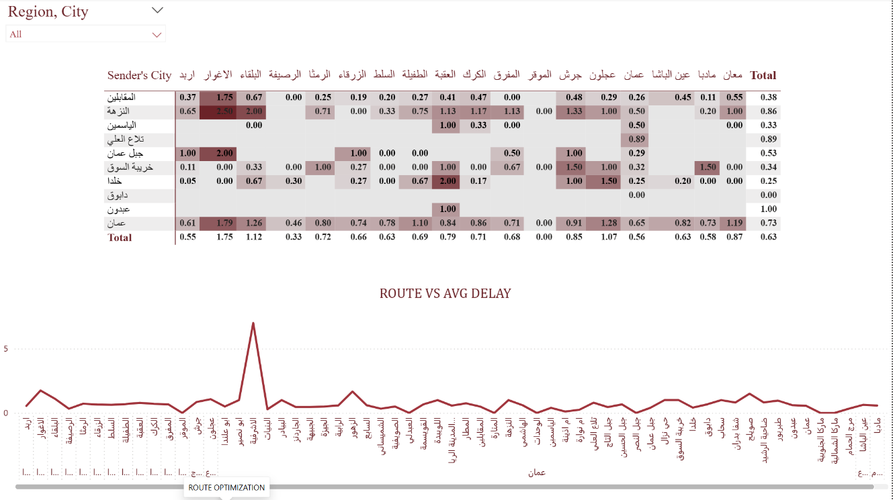

#### Route Optimization Dashboard

**Dashboard Purpose**

This dashboard focuses on route optimization and delivery delay analysis between sender cities and destination cities. It helps identify routes with the highest delays to improve logistics planning, delivery efficiency, and route management.

**Route Delay Heatmap (Matrix Chart)**

Displays the average delivery delay between sender cities and destination cities using color intensity.

**Business Use:** Helps identify problematic routes with high delays, allowing the company to optimize delivery paths, improve scheduling, and reduce transportation inefficiencies.

**Route vs Average Delay (Line Chart)**

Shows the average delivery delay across different delivery routes.

**Business Use:** Allows management to monitor route performance and detect routes that consistently experience high delays, supporting better route planning and operational decisions.

**Region / City Filter**

Allows filtering by specific cities or regions.

**Business Use:** Supports detailed regional analysis and enables managers to focus on specific operational areas or delivery routes.

**How This Dashboard Supports the Project**

This dashboard supports the project by analyzing logistics performance and route efficiency using business intelligence techniques. It helps Fast Man company identify inefficient delivery routes, reduce delays, optimize transportation operations, and improve customer service through data-driven decision-making.

---

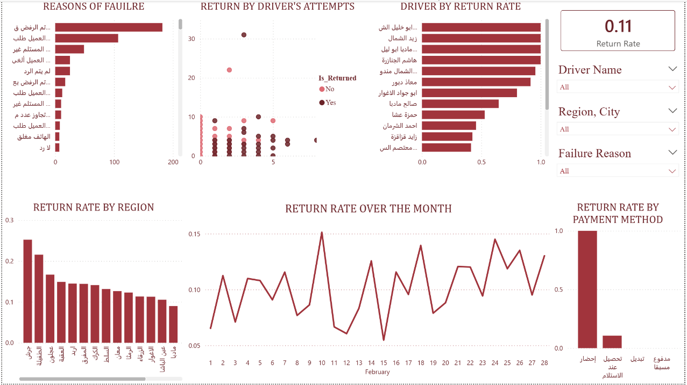

#### Failure Reason Dashboard

**Dashboard Purpose**

This dashboard focuses on analyzing returned orders and delivery failures. It helps identify the main reasons for returns, evaluate driver performance, monitor regional return rates, and improve delivery and customer service operations.

**Reasons of Failure (Bar Chart)**

Displays the most common reasons for failed or returned deliveries.

**Business Use:** Helps management identify operational problems such as customer rejection, unreachable customers, or incorrect information, allowing improvements in delivery processes and customer communication.

**Return by Driver's Attempts (Scatter Plot)**

Shows the relationship between delivery attempts and returned orders.

**Business Use:** Helps analyze whether repeated delivery attempts increase the probability of returns and support improving delivery scheduling efficiency.

**Driver by Return Rate (Bar Chart)**

Compare drivers based on their return rates.

**Business Use:** Supports driver performance evaluation by identifying drivers with high return rates and improving operational accountability and training.

**Return Rate KPI Card**

Displays the overall return rate.

**Business Use:** Provides a quick measure of delivery quality and operational performance related to returned orders.

**Return Rate by Region (Bar Chart)**

Shows return rates across different regions and cities.

**Business Use:** Helps identify locations with high return rates to improve logistics planning and customer service in those areas.

**Return Rate Over the Month (Line Chart)**

Displays changes in return rates over time during February.

**Business Use:** Allows management to monitor trends, detect operational issues, and evaluate the effectiveness of corrective actions.

**Return Rate by Payment Method (Bar Chart)**

Compare return rates across payment methods.

**Business Use:** Helps determine whether certain payment methods are associated with higher return rates, supporting financial and operational decision-making.

**Filters / Slicers**

Includes filters for driver name, region/city, and failure reason.

**Business Use:** Allows detailed analysis of returned orders and operational issues based on specific drivers, regions, or failure causes.

**How This Dashboard Supports the Project**

This dashboard supports the project by analyzing delivery failures and return behavior using business intelligence and analytics techniques. It helps Fast Man company reduce returned orders, improve delivery operations, optimize driver performance, and enhance customer satisfaction through data-driven decision-making.

---

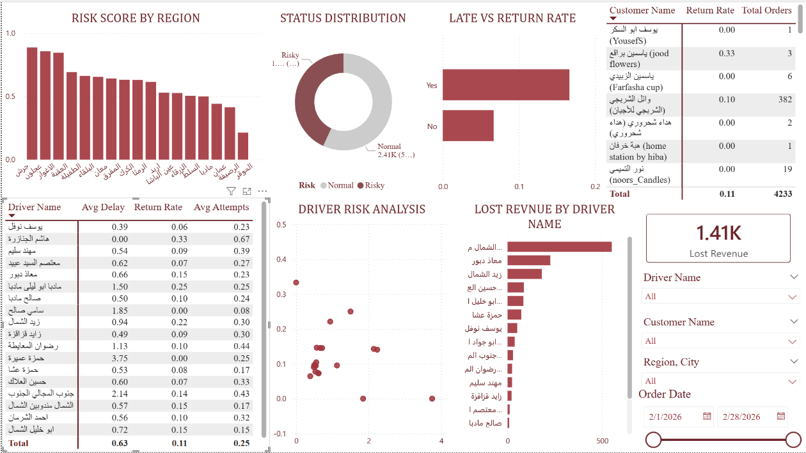

#### Performance & Risk Analysis Dashboard

**Dashboard Purpose**

This dashboard focuses on operational risk analysis by evaluating delays, return behavior, risky regions, driver performance, and lost revenue. It helps Fast Man company identify high-risk operations and improve delivery efficiency and financial performance.

**Risk Score by Region (Bar Chart)**

Shows risk levels across different regions and cities.

**Business Use:** Helps identify high-risk regions with more delays or returns, supporting better operational planning and resource allocation.

**Status Distribution (Donut Chart)**

Displays the percentage of normal and risky orders.

**Business Use:** Provides an overview of operational stability and helps management monitor delivery risk levels.

**Late vs Return Rate (Bar Chart)**

Compare return rates between late and non-late deliveries.

**Business Use:** Shows the relationship between delays and returns, helping management understand how delivery delays affect customer satisfaction and order returns.

**Customer Performance Table**

Displays customer return rates and total orders.

**Business Use:** Helps identify customers with high return behavior and supports customer relationship and service management.

**Driver Performance Table**

Shows driver average delay, return rate, and delivery attempts.

**Business Use:** Supports driver performance evaluation and helps identify operational weaknesses among drivers.

**Driver Risk Analysis (Scatter Plot)**

Analyzes driver risk patterns based on operational indicators.

**Business Use:** Helps identify drivers associated with higher operational risk and supports performance improvement strategies.

**Lost Revenue by Driver Name (Bar Chart)**

Displays estimated lost revenue caused by drivers.

**Business Use:** Helps management measure financial losses linked to operational inefficiencies and improve cost control.

**Lost Revenue KPI Card**

Shows total estimated lost revenue.

**Business Use:** Provides a quick financial indicator of operational losses resulting from delays and returns.

**Filters / Slicers**

Includes filters for driver name, customer name, region/city, and order date.

**Business Use:** Allows detailed operational and financial analysis for specific drivers, customers, or regions.

**How This Dashboard Supports the Project**

This dashboard supports the project by combining operational analytics and business intelligence to identify delivery risks, analyze financial losses, evaluate driver performance, and improve logistics decision-making. It helps Fast Man company reduce operational risk, improve customer satisfaction, and optimize delivery performance using data-driven insights.

---

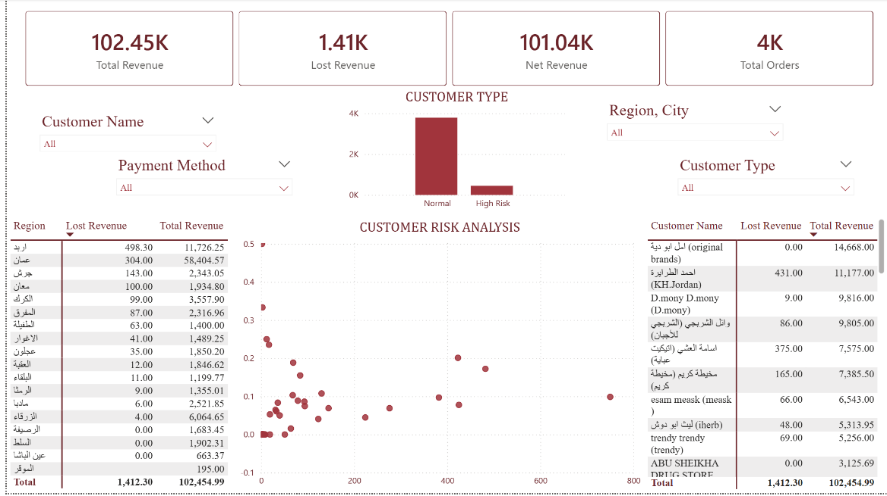

#### Financial & Customer Insights Dashboard

**Purpose of the Dashboard**

This dashboard focuses on analyzing customer revenue, lost revenue, and customer risk behavior. It helps the company identify high-value customers, risky customers, and regions contributing most to revenue loss. The dashboard supports decision-making by improving customer management, reducing financial losses, and strengthening business profitability.

**Total Revenue, Lost Revenue, Net Revenue, Total Orders (KPI Cards)**

These KPI cards provide a summary of overall business performance:

- Total Revenue shows total generated income.
- Lost Revenue represents revenue lost due to failed or returned orders.
- Net Revenue shows actual revenue after losses.
- Total Orders display the total number of orders processed.

**Business Use:** Helps management monitor overall financial performance and evaluate operational efficiency.

**Customer Type (Bar Chart)**

This chart compares Normal customers and High-Risk customers.

**Business Use:** Helps the company identify risky customer groups that may cause higher returns or losses.

**Customer Risk Analysis (Scatter Plot)**

The scatter plot analyzes relationships between customer behavior, revenue contribution, and risk level.

**Business Use:** Helps identify customers with high revenue but also high risk, enabling better customer management strategies.

**Region Revenue Table**

This table displays Lost Revenue and Total Revenue by region.

**Business Use:** Helps management identify regions generating the highest losses and regions with strong financial performance.

**Customer Revenue Table**

This table analyzes customer-level performance using:

- Customer Name
- Lost Revenue
- Total Revenue

**Business Use:** Helps identify valuable customers and customers causing major losses.

**Filters (Customer Name, Payment Method, Region, Customer Type)**

Interactive filters allow users to dynamically analyze specific customer groups, regions, or payment methods.

**Business Use:** Improves flexibility in operational analysis and managerial reporting.

**Overall Contribution to the Project**

This dashboard supports the project by combining financial analysis, customer segmentation, and risk evaluation into a single business intelligence solution. It helps Fast Man Company improve revenue monitoring, identify risky customers, reduce financial losses, and support data-driven strategic decisions.

---

## Advanced Analytics and AI Modeling

This phase of the project focused on applying machine learning and advanced analytics techniques to analyze delivery performance, customer behavior, and operational risk within Fast Man Company in Jordan. Python, Google Colab, and machine learning libraries were used to build predictive models and perform customer and delivery segmentation using clustering techniques.

### Supervised Models

To support predictive analysis and improve operational decision-making, supervised machine learning models were implemented to predict delivery outcomes such as late deliveries and returned orders based on operational and customer-related features.

- **Logistic Regression**
Logistic Regression was used as a baseline classification model due to its simplicity and interpretability. The model helped analyze how variables such as delivery delay, driver attempts, payment method, customer region, and delivery status affect the probability of late or returned orders.

- **Random Forest**
Random Forest was selected because of its ability to capture complex relationships between operational variables and delivery outcomes. The model combines multiple decision trees to improve prediction accuracy and reduce overfitting, making it highly effective for analyzing delivery risk and operational performance.

### Clustering Analysis

- **K-Means Clustering**
K-Means clustering was applied to segment deliveries, customers, and operational patterns into distinct groups based on factors such as delivery delays, return rates, driver performance, revenue contribution, and customer risk behavior.

The clustering process helped identify:

- High-risk customers
- High-performing drivers
- Regions with operational delays
- Customers with high revenue contribution
- Delivery patterns associated with returns and delays

### Prediction Model

Prediction analysis was used in this project to predict delivery outcomes such as late deliveries and returned orders using historical operational data from Fast Man Company. Machine learning models were implemented in KNIME to support data-driven decision-making and improve operational efficiency.

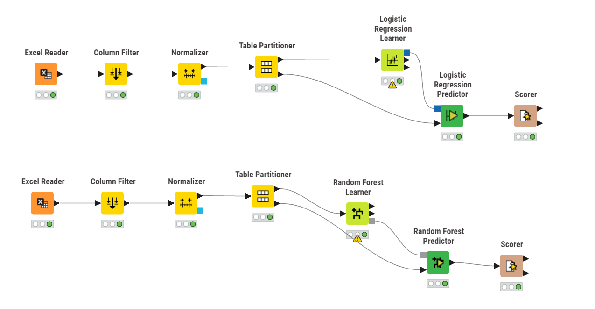

The following steps were performed:

- Excel Reader: Imported the delivery dataset.
- Column Filter: Selected important features related to delays, returns, drivers, customers, and payment methods.
- Normalizer: Scaled numerical values to improve model performance.
- Table Partitioner: Split the dataset into training and testing sets.
- Logistic Regression Learner and Predictor: Built a classification model to predict operational outcomes.
- Random Forest Learner and Predictor: Applied a more advanced model to improve prediction accuracy.
- Scorer: Evaluated model performance using classification metrics.

These preprocessing and modeling steps ensured that the dataset was clean, structured, and suitable for machine learning analysis. The models helped identify operational risks and improve delivery performance and decision-making.

---

#### Logistic Regression

The Logistic Regression model was implemented to predict operational outcomes such as returned orders and delivery performance. The model achieved an overall accuracy of **73.9%**, indicating good predictive performance for operational classification.

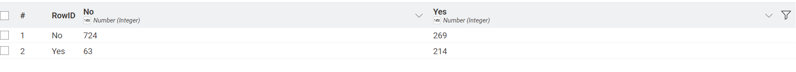

The confusion matrix showed:

- **724** correctly predicted non-returned orders.
- **214** correctly predicted returned orders.
- **63** returned orders incorrectly predicted as non-returned.
- **269** non-returned orders incorrectly predicted as returned.

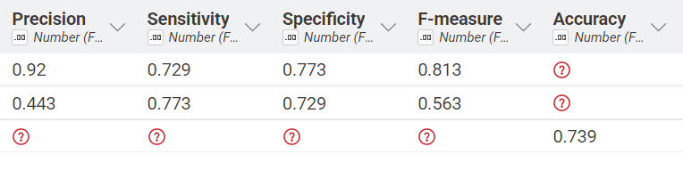

The evaluation metrics demonstrated balanced model performance:

- Recall: 72.9% and 77.3%
- Precision: 92% for non-returned orders and 44.3% for returned orders
- Specificity: 77.3%
- F-Measure: 81.3% and 56.3%

These results indicate that the Logistic Regression model performed well in identifying normal delivery outcomes while also providing acceptable performance in detecting returned orders. The model supports operational risk prediction and helps Fast Man Company improve delivery monitoring, reduce return rates, and enhance decision-making through predictive analytics.

---

#### Random Forest

The Random Forest model was implemented to improve prediction accuracy for operational outcomes such as returned orders and delivery performance. The model achieved an overall accuracy of **77.5%**, outperforming the Logistic Regression model.

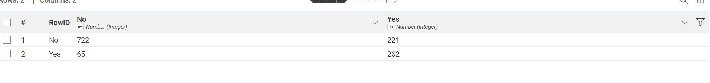

The confusion matrix showed:

- **722** correctly predicted non-returned orders.
- **262** correctly predicted returned orders.
- **65** returned orders incorrectly predicted as non-returned.
- **221** non-returned orders incorrectly predicted as returned.

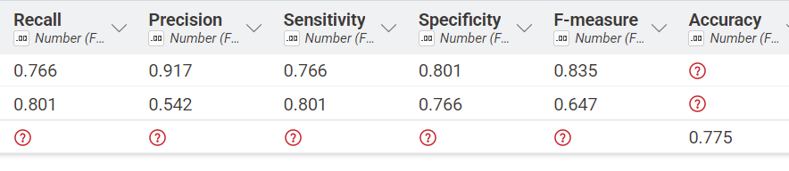

The evaluation metrics demonstrated strong model performance:

- Recall: 76.6% and 80.1%
- Precision: 91.7% for non-returned orders and 54.2% for returned orders
- Specificity: 80.1%
- F-Measure: 83.5% and 64.7%

These results indicate that the Random Forest model provided better classification performance and was more effective in identifying returned orders compared to Logistic Regression. The model supports operational risk prediction, improves delivery performance analysis, and helps Fast Man Company reduce return rates and enhance data-driven decision-making.

---

#### Model Comparison

Two supervised machine learning models were implemented and evaluated in this project: Logistic Regression and Random Forest. Both models were used to predict operational outcomes such as returned orders and delivery performance.

| Metric | Logistic Regression | Random Forest |
| --- | --- | --- |
| Accuracy | 73.9% | 77.5% |
| Recall | 72.9% – 77.3% | 76.6% – 80.1% |
| Precision | 92% / 44.3% | 91.7% / 54.2% |
| F-Measure | 81.3% / 56.3% | 83.5% / 64.7% |

**Model Performance Analysis**

- Logistic Regression provided good baseline performance and was effective for interpreting relationships between operational variables and delivery outcomes.

- Random Forest achieved higher accuracy, recall, and F-measure values, indicating stronger predictive performance and better classification of returned orders.

**Winning Model**

The **Random Forest model outperformed Logistic Regression** and was selected as the best-performing model in this project. Its ability to capture more complex relationships between variables improved prediction accuracy and operational risk detection.

---

### Clustering

Clustering analysis was applied in this project using the **K-Means algorithm** to group deliveries and customers into different clusters based on operational behavior and performance patterns. The purpose of clustering was to identify hidden patterns in the data and support better operational and business decision-making within Fast Man Company.

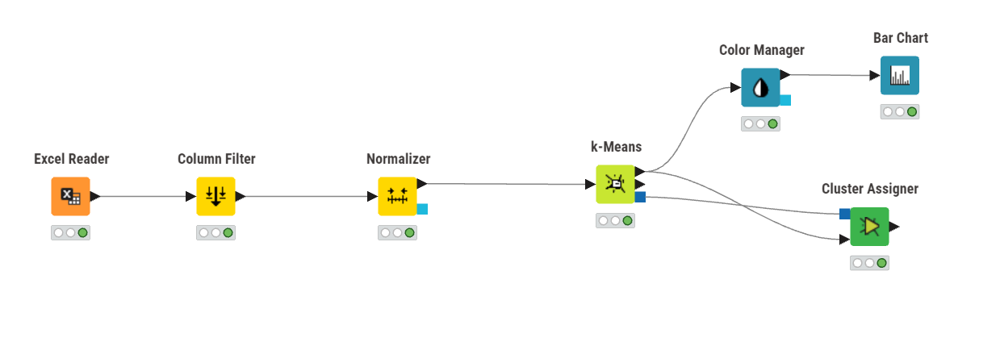

The following steps were implemented in KNIME:

- Excel Reader: Imported the operational dataset.
- Column Filter: Selected important features related to delays, returns, delivery attempts, revenue, and customer behavior.
- Normalizer: Standardized numerical variables to improve clustering accuracy.
- K-Means: Applied the K-Means clustering algorithm to segment the data into distinct groups.
- Color Manager: Assigned colors to clusters for easier visualization and interpretation.
- Bar Chart: Visualized the distribution of clusters and customer groups.
- Cluster Assigner: Assigned each record to its corresponding cluster.

Clustering analysis helped uncover hidden behavioral patterns within the operational data. These insights support Fast Man Company in improving customer segmentation, optimizing delivery operations, reducing operational risks, and supporting data-driven strategic decisions through business intelligence and AI analytics.

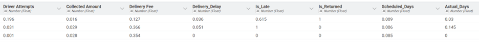
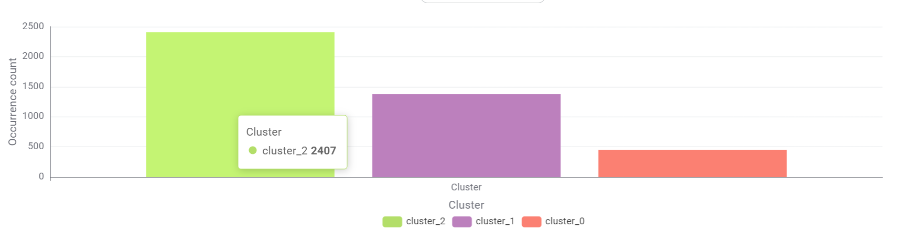

K-Means clustering was used to group deliveries based on operational behavior such as delays, return status, delivery attempts, delivery duration, and fees. After preprocessing and normalization, the algorithm generated 3 different clusters representing delivery performance and risk levels.

#### Cluster 2 – Stable Deliveries (2407 records)

This is the largest cluster and represents normal operational behavior with low delays, low return rates, and smooth delivery performance.

**Business Strategy:**

- Maintain current delivery processes and service quality
- Use this cluster as the benchmark for operational performance
- Focus on customer retention and loyalty programs
- Increase efficiency through automation and optimized routing

---

#### Cluster 1 – Moderate Risk Deliveries (1379 records)

This cluster shows moderate delays and a higher probability of late deliveries compared to Cluster 2.

**Business Strategy:**

- Improve route planning and scheduling
- Monitor driver performance more closely
- Apply proactive customer communication for delayed deliveries
- Use predictive monitoring to reduce escalation into returns or failures

---

#### Cluster 0 – High Risk Deliveries (447 records)

This is the smallest but most critical cluster. It contains deliveries with high delays, more delivery attempts, and stronger return behavior.

**Business Strategy:**

- Assign experienced drivers to risky deliveries
- Prioritize these deliveries for operational monitoring
- Improve address validation and customer confirmation processes
- Introducing risk alerts and escalation systems to reduce failed deliveries and revenue loss

**Business Value**

The clustering analysis helps transform delivery data into actionable operational segments. It supports better decision-making, improves delivery efficiency, reduces risks, and enables targeted operational strategies for each delivery group.

---

## Tools Research and Selection Effort

Several tools were selected and used throughout the project to support data preprocessing, machine learning, clustering, and dashboard visualization.

### KNIME

KNIME was used to build the machine learning workflows and perform the predictive and clustering analysis. It was used for:

Data preprocessing and normalization, Feature selection and column filtering

Data partitioning into training and testing sets, Building Logistic Regression and Random Forest models, Applying K-Means clustering & Evaluating model performance using classification metrics

KNIME provided a visual workflow environment that simplified the implementation and comparison of analytical models.

### Python

Python supported the analytical process through data handling and machine learning libraries such as Pandas, NumPy, Scikit-learn, and Matplotlib. It was used for additional analysis, preprocessing support, and understanding model behavior.

### Power BI

Power BI was used to create interactive dashboards and KPIs related to delivery performance, delays, return rates, revenue, driver analysis, and risk analysis. The dashboards supported operational monitoring and business decision-making through filters and visual insights.

Together, these tools created a complete analytics workflow from data preparation and AI modeling to dashboard visualization and business analysis.

---

## Project Deployment Effort – Use Case

### 1. Dashboard Monitoring and Decision Support

The Power BI dashboards help management monitor:

- Delivery performance and success rates
- Delay and return trends
- Driver performance and risk analysis
- Revenue and lost revenue
- Regional and route performance

**Business Uses**

- Detect operational issues quickly
- Monitor high-risk deliveries and drivers
- Improve delivery planning and routing
- Support faster and data-driven decisions

---

### 2. Prediction Models – Delivery and Return Forecasting

Machine learning models were used to predict delivery outcomes and return behavior using historical operational data.

**Business Uses**

- Predict delayed or returned deliveries
- Identify risky delivery operations early
- Improve driver assignment and scheduling
- Reduce operational losses and failed deliveries

Random Forest achieved better predictive performance, while Logistic Regression provided simpler and more interpretable results.

---

### 3. Clustering – Delivery Segmentation

K-Means clustering was applied to segment deliveries into groups based on delays, return behavior, attempts, and operational performance.

**Business Applications**

- Identify high-risk delivery groups
- Improve operational prioritization
- Create targeted strategies for different delivery behaviors
- Enhance delivery efficiency and customer satisfaction

---

### Overall Business Value

By combining dashboards, predictive models, and clustering analysis:

- Dashboards answer: **"What is happening?"**
- Prediction models answer: **"What is likely to happen next?"**
- Clustering answers: **"Which operational groups require attention?"**

Together, these analytical approaches improve operational efficiency, reduce delays and returns, optimize driver performance, and support smarter business decisions.

---

## Results

The project results show that combining Business Intelligence and AI techniques provides valuable operational insights.

The dashboards revealed that delivery performance is strongly influenced by:

- Driver performance
- Delivery attempts
- Route and region
- Delay duration
- Return behavior

The predictive models successfully forecasted delivery and return outcomes with strong accuracy, especially the Random Forest model, which captured complex operational patterns more effectively.

The clustering analysis identified meaningful delivery groups, including stable deliveries, moderate-risk deliveries, and high-risk deliveries. These insights help the company improve resource allocation, reduce losses, and optimize delivery operations.

Overall, the project demonstrates how BI and AI techniques can transform raw operational data into actionable insights that support smarter logistics strategies and data-driven decision-making.

---
# **References**
